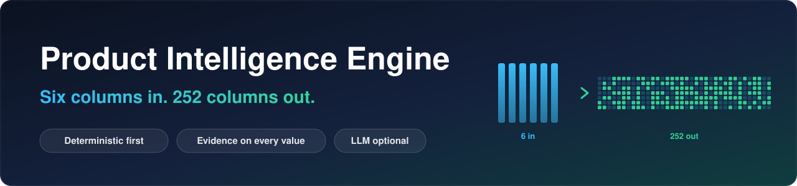
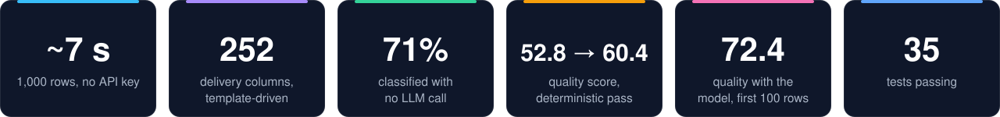
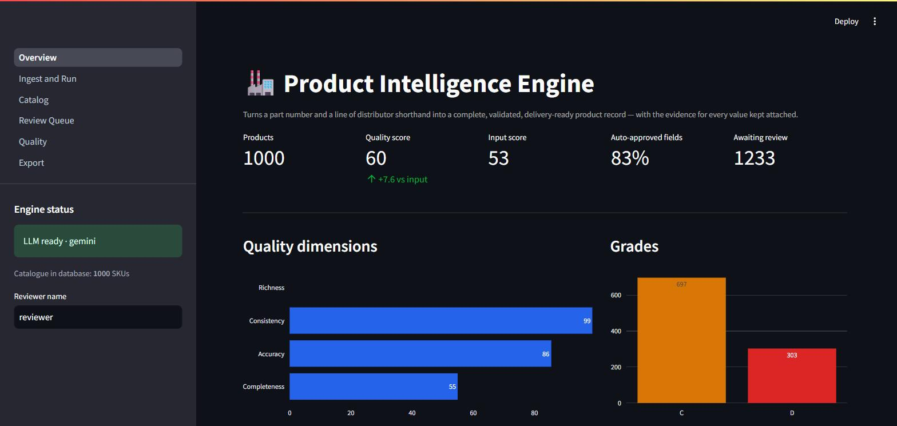
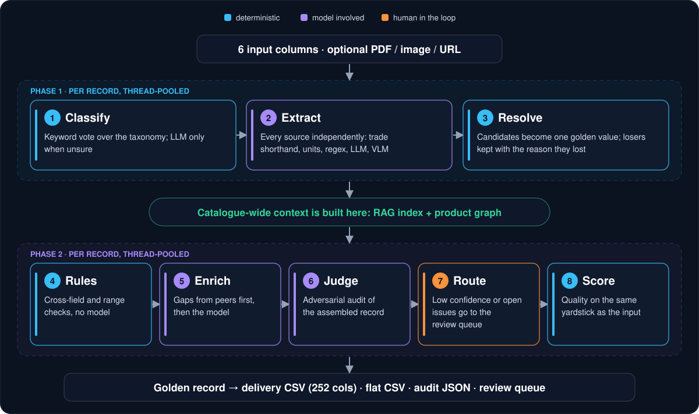
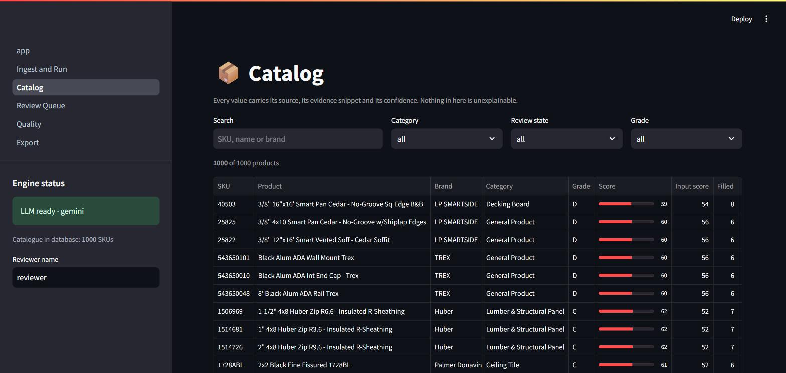
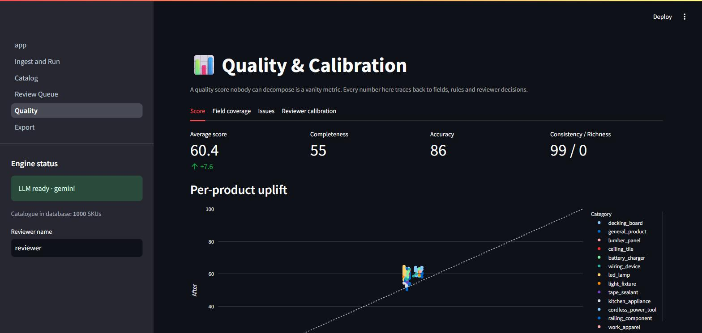
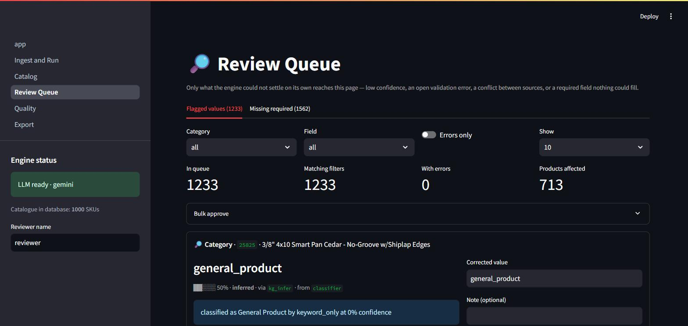
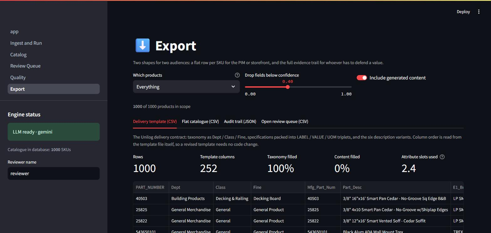

<p align="center">
  
</p>

<p align="center">
  
  
  
  
  
  
</p>

<p align="center">
  <b>A part number and a short distributor description go in. A complete, validated, delivery-ready product record comes out, with the evidence for every value.</b><br>
  Built for the UniHack product-intelligence challenge.
</p>

<p align="center">
  <a href="#-results">Results</a> ·
  <a href="#-how-it-works">How it works</a> ·
  <a href="#-quick-start">Quick start</a> ·
  <a href="#-the-app">The app</a> ·
  <a href="SUBMISSION.md">Submission notes</a> ·
  <a href="UniHack_Prototype_Deck.pptx">Deck</a>
</p>

<p align="center">
  
</p>

<p align="center">
  <br>
  <sub>The shipped snapshot: 1,000 products, 900 from the deterministic pass and 100 model-enriched.</sub>
</p>

## ✨ What makes it different

<table>
  <tr>
    <td width="50%" valign="top">
      <h4>⚡ Deterministic first</h4>
      Trade shorthand like <code>P150</code> or <code>27k</code> is decoded by rules before any model call. 71% of the catalogue is classified that way and all 1,000 rows run in about 7 seconds with no API key. The model only sees what the decoders could not resolve.
    </td>
    <td width="50%" valign="top">
      <h4>🔍 Evidence on every value</h4>
      Source, evidence snippet, method, confidence and rejected alternatives travel with each value, and an adversarial LLM judge audits the finished record.
    </td>
  </tr>
  <tr>
    <td valign="top">
      <h4>🛑 Blank beats wrong</h4>
      Anything below the publish floor is held back, and low-confidence values go to a human review queue. A blank cell is recoverable; a confident wrong value is not.
    </td>
    <td valign="top">
      <h4>🏷️ Supplier is not manufacturer</h4>
      The supplied <code>Part_Manuf</code> column names the account the distributor buys from. The identity resolver separates supplier, brand and manufacturer instead of publishing a reseller as the maker.
    </td>
  </tr>
</table>

## 📊 Results

Everything below can be reproduced from this repo. The first table needs no API key.

**Deterministic pass: all 1,000 rows, zero API calls**
(`python scripts/run_pipeline.py "data/raw/Unihack_ Sample Dataset - Input.csv" --no-llm`)

| Metric | Result |
| --- | --- |
| Rows processed | 1,000 of 1,000, none failed, in about 7–9 s |
| Quality score | **52.8 → 60.4** (completeness 55 · accuracy 86 · consistency 99 · richness 0) |
| Fields filled | 7,330: 83% auto-approved, 1,233 flagged for review |
| Keyword classifier | 710 rows (**71%**) settled on its own; 290 stay `General Product` |
| Brand published | 885 rows: 333 read from the input, 335 recovered from the description's brand vocabulary, 217 inferred from catalogue peers |
| Placeholder-brand rows | 439 of the 554 rows whose three brand columns are all placeholders now carry a brand (79%) |
| Manufacturer published | 903 rows |
| Delivery file | 252 columns · identity 96% · taxonomy 100% · content 0% |

**Model-enriched slice: the first 100 rows, run with a Gemini key**

| Metric | Input | Deterministic | With the model |
| --- | --- | --- | --- |
| Quality score | 51.6 | 59.6 | **72.4** |
| Grade mix | — | C 64 · D 36 | B 31 · C 66 · D 2 · F 1 |
| Six description columns filled | 0% | 0% | **100%** |
| Attribute triplets per product | — | 3.7 | **5.9** |
| Feature bullets per product | — | 0 | **5.0** |
| Taxonomy coverage | — | 100% | 100% |

411 model calls (`gemini-3.1-flash-lite`), no failures, 100 of 100 rows completed. The delivery files for this slice are in `outputs/exports/submission_llm100*.csv`.

> [!NOTE]
> The slice is the first 100 rows of the file: 58% abrasives and 33% appliances. Decking boards, LED lamps and light fixtures, about a third of the catalogue, are not in it, so 72.4 is not an estimate for the whole file. The screenshots here show the shipped snapshot (`data/pie.db`): 900 deterministic rows plus these 100, so its overall score is 61.7 against an input score of 52.8.

## 🧩 How it works

<p align="center">
  
</p>

Stage order is not arbitrary. Classification comes first because the category decides which attributes exist at all. Rules run before the model judge because they are free and more reliable. The RAG index and product graph are built *between* the two phases, so enrichment can borrow from peers that have already been extracted. Otherwise the first products processed would have no peers.

<details>
<summary><b>🧠 Design decisions worth knowing</b></summary>

- **Deterministic before probabilistic.** A distributor description is not prose, it is compressed trade shorthand. `3M 775L Stikit Film P150 - Cubitron II 50 Disc/Box` yields form, grit, attachment system, pack quantity and selling unit with no API call at all. The model only ever sees what the decoders could not resolve.
- **The supplier column is not the manufacturer.** `Part_Manuf` names the account the distributor buys from. For a 3M abrasive that is "Jam Industrial Supply LLC"; for a Diablo belt it is "Freud Inc": the same column, a reseller in one row and the maker in the next. `src/normalize/identity.py` publishes it as `supplier`, then resolves brand from the brand columns, the description's own brand vocabulary, and finally maker-style account names. On the supplied file that publishes a brand on 885 rows (552 of them recovered rather than read from the brand columns) and a manufacturer on 903, with no API call.
- **Inference stays inside its scope.** Peer consensus is powerful and blind: a brandless Diablo belt sitting in a 3M-dominated abrasives group will inherit 3M's `775L` series unless something stops it. Brand-scoped attributes (series, model, UPC) are refused from a category-only peer group.
- **Ambiguity is refused, not guessed.** When a messy header fuzzy-matches two different canonical keys within the margin, it maps to neither. Silent mis-mapping is the most expensive error in a catalogue.
- **Peer inference is flagged, not hidden.** A value inferred from catalogue siblings ("88% of peers ship 50 per box") is written at reduced confidence (method `kg_infer`, about 0.6), marked `needs_review` and routed to a human. The delivery template has no confidence column, so until a reviewer approves or rejects it the value does appear in the export: 217 brands and 221 manufacturers in the shipped snapshot.
- **Blank beats wrong.** Anything below the publish floor (0.40) is held back. A blank cell is recoverable; a confident wrong value is not.
- **The human loop is closed.** Every approve / edit / reject is written to `review_decisions`, and the Quality page turns those into an agreement rate and a per-method approval rate, which is how you discover that a confidence constant in `config.py` is set too high.

</details>

## 🚀 Quick start

```bash
git clone https://github.com/ishaan-sandhwar/product-intelligence-engine.git
cd product-intelligence-engine

python -m venv .venv
.venv\Scripts\activate            # Windows.  source .venv/bin/activate elsewhere
pip install -r requirements.txt

copy .env.example .env             # then paste in one API key (any provider)
streamlit run Overview.py
```

Load `data/raw/Unihack_ Sample Dataset - Input.csv` on the **Ingest & Run** page.

**No API key?** It still runs: the deterministic path (shorthand decoding, unit conversion, rules, catalogue peers) does the work and content generation is skipped. One key is enough for the model path. The 100-row slice above ran on Gemini, and the default pacing (13 requests a minute) is set for its free tier.

<details>
<summary><b>⌨️ Headless runs and tests</b></summary>

```bash
python scripts/run_pipeline.py "data/raw/Unihack_ Sample Dataset - Input.csv" --limit 150
python scripts/run_pipeline.py catalog.csv --no-llm                    # deterministic only
python scripts/run_pipeline.py catalog.csv --concurrency 8 --audit out.json
python scripts/run_pipeline.py catalog.csv --delivery submission.csv   # the 252-column file

pytest tests -q        # 35 tests: identity resolution, dimension shorthand, request pacing
```

The suite covers the decoding rules that are expensive to get wrong: that a distributor account never reaches the manufacturer line, that a round abrasive is read as diameter and not width, and that `1x6-16'` is a one-inch board six inches wide and sixteen feet long.

</details>

## 📸 The app

| Page | What it is for |
| --- | --- |
| **Overview** | Catalogue KPIs, quality dimensions, grade mix, run history |
| **Ingest & Run** | Load the catalogue or build one product from a part number; attach datasheets, images, URLs |
| **Catalog** | Per-product inspection: values, evidence snippets, rejected alternatives, issues, stage log |
| **Review Queue** | Approve / correct / reject flagged values, and fill required fields nothing could source |
| **Quality** | Score decomposition, field coverage, issue mix, reviewer calibration |
| **Export** | Delivery template CSV, flat CSV, audit JSON, open-queue CSV |

<table>
  <tr>
    <td align="center"></td>
    <td align="center"></td>
  </tr>
  <tr>
    <td align="center"><sub><b>Catalog</b>: every value with its source</sub></td>
    <td align="center"><sub><b>Quality</b>: score decomposition and uplift</sub></td>
  </tr>
  <tr>
    <td align="center"></td>
    <td align="center"></td>
  </tr>
  <tr>
    <td align="center"><sub><b>Review queue</b>: flagged values with the reason</sub></td>
    <td align="center"><sub><b>Export</b>: the 252-column delivery template</sub></td>
  </tr>
</table>

## 📚 Reference

<details>
<summary><b>📦 The delivery template</b></summary>

`src/export/delivery.py` renders the golden records into the supplied `resources/Unihack_ Expected Output - Delivery Format.csv` contract. The header row of that file *is* the column order. It is read at export time, so a revised template drops in without a code change.

| Template block | Where it comes from |
| --- | --- |
| `Dept` / `Class` / `Fine` / `Classpath` | the taxonomy attached to the classified category in `schemas/attributes.json` |
| `PART_NUMBER`, `Mfg_Part_Num`, brand and manufacturer columns | the input row, echoed verbatim (placeholders included) plus the cleaned canonical values |
| `MOBILE_DESC` … `MARKETING_DESCRIPTION` | six generated variants, each with its own register and length taken from the template's worked example |
| `ITEM_FEATURES_1..20` | generated feature phrases, one specification each |
| `ATTRIBUTE_LABEL/VALUE/UOM 1..50` | verified attributes packed in priority order: required first, then schema weight, then confidence |
| `LENGTH`/`WIDTH`/`HEIGHT`/`WEIGHT` + `_UOM` | canonical dimension attributes with their units |
| Image and document columns | attached sources, matched to document type by filename |

Canonical units are **imperial** (`in`, `ft`, `lb`) because that is what this trade publishes and the template carries its own UOM column. Converting a 24-inch dishwasher to 609.6 mm would be correct and useless.

</details>

<details>
<summary><b>🔌 Providers and rate-limit pacing</b></summary>

The client picks the first configured provider in `PROVIDER_PRIORITY` (`config.py`) and skips the rest, so one key is enough:

| Provider | Env var | Text | Vision |
| --- | --- | --- | --- |
| Anthropic | `ANTHROPIC_API_KEY` | claude-sonnet-5 | ✓ |
| Gemini | `GEMINI_API_KEY` | gemini-3.1-flash-lite | gemini-3.6-flash |
| OpenAI | `OPENAI_API_KEY` | gpt-4o-mini | gpt-4o |
| Groq | `GROQ_API_KEY` | llama-3.3-70b-versatile | — |

Responses are cached by a hash of `(provider, model, request)`, so an identical request is never paid for twice. Prompts that embed catalogue context change when the catalogue state changes, so a re-run only reuses what is byte-identical.

Every provider is paced by a client-side token bucket (`LLM_RPM_LIMITS`), because a free-tier 429 still consumes a request slot, and discovering the ceiling by hitting it poisons the following minute too. Gemini's free tier allows 15 requests per minute per model; the default of 13 leaves room for retries. When a 429 does arrive, the server's own `retryDelay` sets the backoff rather than an exponential guess that would land early and burn another slot.

</details>

<details>
<summary><b>🎯 Quality score</b></summary>

```
overall = 0.35·completeness + 0.25·accuracy + 0.20·consistency + 0.20·richness
```

- **completeness**: weighted fill rate over the attributes that apply to the class
- **accuracy**: mean confidence, penalised for missing evidence and open errors
- **consistency**: survives cross-field and unit checks (absence is *not* counted here; that is completeness's job, and double-counting it made records score lower after processing than before)
- **richness**: presence and adequacy of the delivery content set against `CONTENT_TARGETS`

Both `quality_before` and `quality_after` are stored, so uplift is measured on the same yardstick rather than asserted. The submission notes also record that the score first went *down* when the model was switched on, because the judge was finally checking values nobody had checked before; the defects it found were fixed at the source (see [SUBMISSION.md](SUBMISSION.md)).

</details>

<details>
<summary><b>🗂️ Repository layout</b></summary>

```
config.py                 paths, model ids, thresholds, scoring weights, content targets
schemas/attributes.json   the canonical dictionary: 26 classes, taxonomy, attributes, content fields
resources/                the delivery template (its header row is the export contract)
Overview.py               Streamlit entry (Overview page)
pages/                    Ingest · Catalog · Review Queue · Quality · Export
scripts/                  headless batch runner, messy-sample generator, deck builder
data/raw/                 the supplied 1,000-row catalogue
data/pie.db               shipped snapshot: 1,000 processed products, review state, LLM response cache
outputs/exports/          the 100-row model-enriched slice (flat and 252-column delivery CSVs)
docs/                     README banner, stat strip and architecture diagram, plus app screenshots
SUBMISSION.md             UniHack submission notes
UniHack_Prototype_Deck.pptx   the submitted prototype deck
src/
  models.py               ProductRecord, AttributeValue, Provenance, QualityScore
  schema.py               attribute dictionary, alias resolution, taxonomy, category guessing
  pipeline.py             stage orchestration, batch runner, human-edit handlers
  store.py                SQLite: records, runs, review decisions
  ingest/                 table loader, document intelligence (PDF/web/image), extractors
  normalize/              unit families and conversion, canonical value shaping
  llm/                    provider abstraction (4 SDKs), response cache, prompts
  validate/               rule engine, conflict resolution, adversarial judge
  enrich/                 RAG retriever, product knowledge graph, enrichment agent
  score/                  the four-dimension quality score
  export/                 delivery-template renderer
  ui/                     shared Streamlit helpers
```

**Extending the schema.** `schemas/attributes.json` drives extraction prompts, validation, scoring and exports. Adding a product class is a JSON edit, not a code change: give it a label, a Dept and Class, keywords for the classifier, and its attributes with `datatype`, `unit`, `unit_family`, `aliases`, `required`. Keywords must describe **products, not brands**: "milw" as a keyword put every Milwaukee cut-off disc into Cordless Power Tool at full confidence, because a brand keyword matches everything that brand sells.

</details>

<details>
<summary><b>⚠️ Honest limits</b></summary>

- Content generation needs an API key; without one, richness scores zero and the six description columns export blank rather than guessed.
- A full 1,000-row model pass is about 4,100 calls (411 per 100 rows), roughly five hours at the default 13 requests a minute. The deterministic pass covers all 1,000 rows in seconds; the model is pointed at a slice.
- The slice is the first 100 rows, mostly abrasives and appliances. Results with the model on decking, LED lamps and light fixtures have not been measured.
- The keyword classifier settles 71% of the supplied catalogue on its own; the other 290 rows fall to the LLM classifier, and to `General Product` when no key is set. How many of them the model can place has not been measured over the whole set: in the shipped slice only 2 rows were left as `General Product`, and the model placed 1 of them.
- Peer-inferred values appear in the delivery export; only the app and the review queue show that they are inferred.
- Web extraction obeys nothing but a timeout: no robots.txt handling, no rate limiter. Fine for a demo, not for a crawl.
- The product graph infers from co-occurrence within the loaded catalogue only; it is rebuilt per run rather than persisted.
- `SKU - MY_PART_NUMBER`, `List Price` and `Prop 65` are left blank: they are distributor-side data that no amount of enrichment can honestly invent.

</details>

## 👥 Team

Built for UniHack by a team of four: **Aditya Shukla** (team leader), **Ishaan Sandhwar**, **Deepak Kumar Behera** and **Piyush Priyanshu**.
